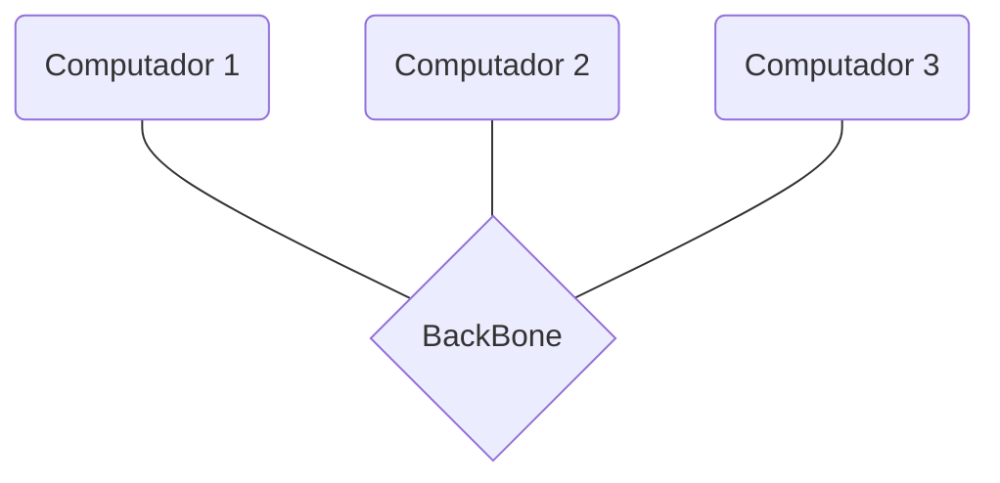
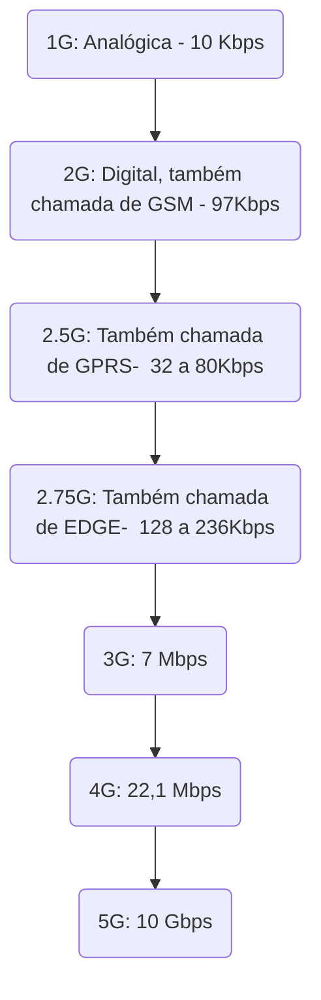

# Primeiros Passos para desenvolvimento Web :globe_with_meridians:

## História da Internet :scroll:

- **1969**: Nos EUA, surge a *ARPANET*, uma rede local que interligava os laboratórios, facilitando a comunicação
- **1982**: Essa tecnologia se expande para as Universidades. 
- **1987**: Permitido seu uso comercial nos Estados Unidos.
- **1992**: *CERN* cria a `World Wide Web`, garantindo que dados estejam acessíveis a qualquer pessoa com acesso à internet.

> [Primeiro domínio criado](https://symbolics.com/, "O primeiro - e até hoje funcional - domínio criado.")

## Redes :link:

Quando se realiza a conexão entre dispositivos, a forma mais fácil é usando um "**BackBone**":

> Ao invés de todos os computadores estarem ligados entre si, cada um se liga a esse dispositivo central *(espinha dorsal)* que efetua as comunicações.
> - Gerenciado de Tráfego da Internet

- **Provedor de Acesso**: Empresas que garantem acesso ao *BackBone* (Contratam esse sinal e repassam ao usuário final)
	-  Eles proveem serviços de conexão como Dial-Ip, ADSL, Fibra ótica, Satélite, Rádio, Móvel ou P2P.

> **Domínio**: "Nome" do site entendível pelo usuário.
> **DNS** (*Domain Name System*): Converte o nome do domínio em endereços IP.

> **TCP** (*Transmission Control Protocol*): Realiza o controle da transmissão de dados pela Internet.
> **IP** (*Internet Protocol*): Identificação de qualquer dispositivo conectado a alguma rede,

 

- TCP e UDP são formas de Conexão entre dispositivos e a Internet:

| TCP | UDP |
|:---:|:---:|
| Voltado à confiabilidade | Voltado à velocidade |
| Confirmação entre quem envia e quem recebe (*Handshake*) | Envia os pacotes sem coordenação (*Não confiável*) |

## Ports :ship:

Dados "ancorando" em diferentes dispositivos
> Norteia por onde os dados sairão e chegarão, coordenando para que eles cheguem ao destino pelo caminho mais efetivo

| Número | Nome | Tipo de dados |
|:---:|:---:| :---:|
| 20  | FTP   | Arquivos |
| 22  | SSH   | Conexão segura |
| 25  | SMTP  | E-mails |
| 53  | DNS   | Tradutor de Domínio para IP |
| 80  | HTTP  | Requisição simples na Internet |
| 443 | HTTPS | Requisição **segura** Internet |

---

> **Modem**: Aparelho que *modula* e *desmodula* sinais (Hardware que converte dados em formato transmissíveis entre computadores para visuais e vice-versa).
> **Roteador**: Distribui a internet para os dispositivos de uma rede e realiza a comunicação entre redes.
> **Switch**: Similar ao roteador, mas distribui os dados recebidos apenas para o destinatário, e não para todos os dispositivos conectados.

### Dados Móveis:

### Wi-fi
*Wireless Fidelity*: Tecnologia de Comunicação que não faz uso de cabos, permitindo a comunicação entre dispositivos sem fio.

### Bluetooth
Realiza uma conexão Ponta-a-Ponta, sem precisar de Wi-fi para se conectar

## Browser :mag:
Para visualizar um site, é preciso um programa que interprete as **Linguagens de Programação** de forma visual.

> Assim, **Browser** são programas que habilitam a interação com documentos em um servidor de rede. 
> Ele sabe identificar várias Linguagens de Programação, de Marcação, além de conteúdo Multimídia. 

- **Cache**: Após acessados, os sites deixam algumas informações salvas para facilitar os futuros carregamentos e aberturas.
- **Cookies**: Rastro que os sites deixam com informações que podem ser acessadas por outros serviços.

---

### Site:
Página da internet que pode possuir diversos propósitos (Entretenimento, colaboração...). Podem ser feitos em diversas LPs.

### Aplicativo:
Software que é executado no Computador/Navegador

### E-Commerce:
Comércio eletrônico, Sites de Compra e Venda com sistemas de Pagamento (podendo inclusive ser externos aos sites).

### Web-server:
Servidores Web responsáveis por processar e responder as requisições recebidas, enviando os arquivos solicitados ao navegador. *Um site, para ser acessado remotamente, precisa estar em um servidor.*

### Web-Service:
Interface disponível para fazer requisições e consultas em Bancos de dados em sistemas desenvolvidos em plataformas diferentes *(como o Governo, Correios, obtendo dados como CPF, CEP...)*.

## Stacks Tecnológicos :bar_chart:

São todas as tecnologias *(incluindo Framewors, bibliotecas, linguagens e outras ferramentas)* usadas para determinado projeto.

Os desenvolvedores precisam saber as limitações e as capacidades das ferramentas e ambientes disponíveis.

> ### **Front-End**
> Desenvolvimento da Interface Gráfica do Usuário *(Sites, softwares, aplicativos, web-service)*, com foco na Interface, UI e UX.

> ### **Back-End**
> Desenvolvimento da estrutura que possibilita a operação do sistema *(Servidores, Banco de dados)*.

> ### **Full Stack**
> Profissional que sabe trabalhar em todas as camadas das tecnologias de desenvolvimento/execução de um app ou software.
